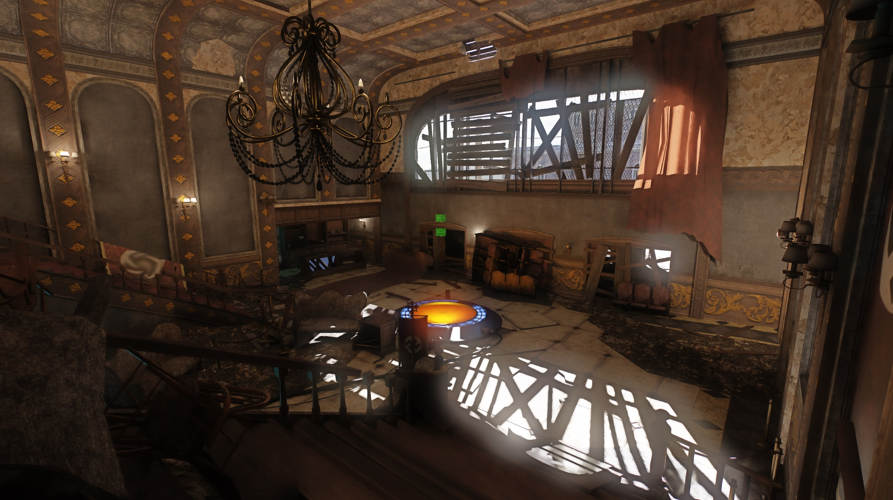
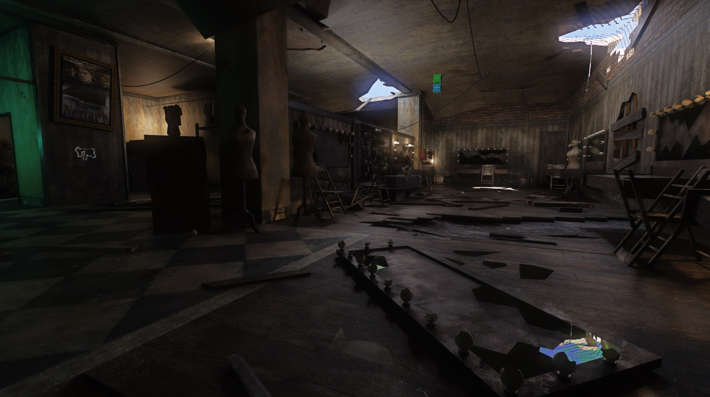

<h2 align="center">CoD: Black Ops RTX Remix compatibility mod</h1>

 

This (sp) client modification is made to make the game compatible with nvidia's [rtx-remix](https://github.com/NVIDIAGameWorks/rtx-remix).  
How? By manually reimplementing fixed function rendering :) 

It does come with a [sample rtx-mod](https://drive.google.com/file/d/143dC21zbohUm31PmHf4C9sqoU-dkwzhU) which places a few lights and has few custom materials.  
(zombie theater and the second SP level)  

 

	

	

# Usage

#### A. Easy way but might not feature the latest and greatest:
  1) Download the latest [release](https://github.com/xoxor4d/t5-rtx/releases) and extract the contents into your CoD:BO1 root directory.  
  
  2) (Optional - _file is included_) Download the latest release of [asi-loader](https://github.com/ThirteenAG/Ultimate-ASI-Loader/releases) (non-x64)  
  and extract the dll that comes with it (probably `dinput8.dll`) into your CoD:BO1 root directory. 
  
  3) (^) Rename the extracted dll file (probably `dinput8.dll`) to `DSOUND.dll`.

  4) Start the game. The in-game console or the game window itself should show `t5-rtx-version` if the .asi was loaded correctly

  5) Read the `Dvars / Console Commands` and `Current issues` sections

 

#### B. Manual way but always up-to-date:

1) All of the above steps

2) (Optional) Install the latest `github action` builds of:  
remix bridge - https://github.com/NVIDIAGameWorks/bridge-remix/actions  
remix runtime - https://github.com/NVIDIAGameWorks/dxvk-remix/actions  

3) Download the latest t5-rtx `github actions` build:  
  Release-binaries-t5-rtx - https://github.com/xoxor4d/t5-rtx/actions 
  - Drop `t5rtx.asi` and the contents of the `assets` folder into your CoD-BO1 root directory and start the game.  

 

#### C. [Game_Mod](https://github.com/Nukem9/LinkerMod) by Nukem

1) Download [this version](https://github.com/xoxor4d/LinkerMod/tags) of game_mod (gets rid of a few asserts that prevent the game from starting)

2) Place `game_mod.asi` into your CoD:BO1 root directory

3) Start the game. The window title should mention game_mod

 
 

## ⚠️ Current issues:
- It is not yet possible to adjust the sky brightness from the games side.  
You have to do that yourself via the remix runtime menu if the level is to bright / dark.
- `vid_restart` (changing resolution / refresh rate) should generally work but might cause instability afterwards
- Main menu TV might can look a little different after a map was loaded (changing hash of TV)
- Gun marks (fx) and particle clouds (fx) are still rendered using shaders (might wobbly a little)
- Like other CoD's, teleporting (fast scenery changes) might crash remix

 

## Advanced Settings:

- A. Per map settings:
  - You can tweak/define per map settings such as: fog, sun, sky and manual culling overrides   
  in the `map_settings.ini` file found in `root/t5rtx`.
  - Manual culling overwrites:  
    - the number `[within square brackets]` defines the cell to be tweaked
	- numbers `(within brackets)` are cells that will always be rendered when the player is in the cell defined above
	- use dvar `r_showCellIndex` to identify cells

- B. Commandline Arguments:  
  - `-no_rtx` :: disable fixed function rendering
  - `-stock_effects` :: render effects using shaders
  - `-no_sun` :: disable directional light spawning (mapsettings)
  - `-no_fog` :: disable fog (mapsettings)
  - `-no_forced_lod` :: do not set __r_forceLod__ to __high__ by default  
  - `-disable_normal_spec` :: disable loading of specular and normal maps (dev. only)  
   
  > eg: &ensp;`c:\path\BlackOps.exe -no_forced_lod -stock_effects` 

- C. Dvars: 
    - `r_forceLod` :: force all models to a specific LOD (highest by default)
    - `r_showTess` :: show various info about surfaces (incl. materials and the images it is using)
	- `r_showTessSkin` :: draw info for skinned meshes
	- `r_showTessDist` :: can be used to limit the draw distance of the 3D text ^
	- `r_showCellIndex` :: draw cell index at the center of the current cell (map settings)
	- `rtx_water_uv_scale` :: UV scale of water
	- `fx_cull_elem_draw_radius` :: disable frustum culling for effects within this radius around the player

 

- D. Console commands:  
  - `mapsettings_update` :: reload __map_settings.ini__ found in __root/t5rtx__

 

## Compiling yourself:
1. Setup `CODBO1_ROOT` environment variable with path to your CoD:BO1 directory (optional)
2. Run `generate-buildfiles_vs22.bat` to generate build files (build folder)
3. Compile and copy `t5rtx.asi` to your CoD:BO1 root folder  
   - ^ automatically happens if you setup `CODBO1_ROOT`

 

## Questions? 
- Join the [rtx-remix showcase](https://discord.gg/j6sh7JD3v9) discord and check out the CoD Black Ops thread within the `remix-projects` channel.
- Join the [iw3xo](https://discord.gg/t5jRGbj) discord if you have questions related to this modification
- RTX Remix: https://github.com/NVIDIAGameWorks/rtx-remix  

 

## Credits
- [People of the showcase discord](https://discord.gg/j6sh7JD3v9) (for testing, feedback and ideas)
- [Nukem - LinkerMod](https://github.com/Nukem9/LinkerMod)
- [Nvidia - RTX Remix](https://github.com/NVIDIAGameWorks/rtx-remix)
- [Rektinator](https://github.com/RektInator)

